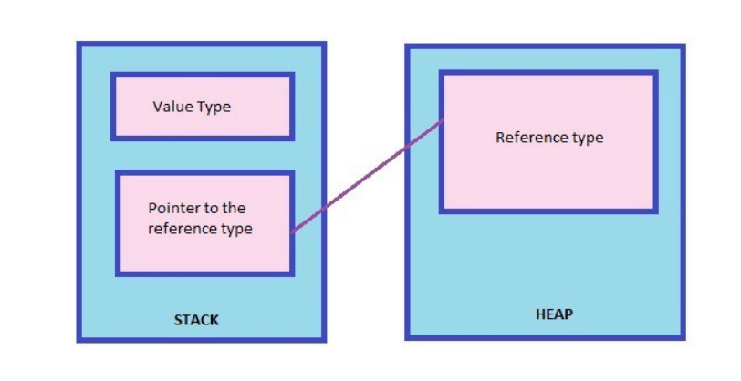

# Memeory Management

## Stack and Heap
Stack and Heap are portions of memory
The Common Language Runtime (CLR) allocates memory for objects in these parts

* Stack
    - is a simple LIFO (Last in first out) structure
    - variables allocated in the Stack stored directly to the memory and access to this memory very fast
    - and its allocation is done when the program is compiled. When a method is invoked
    - When the method completes, the CLR resets the stack to its previous bookmark, popping all the method’s memory allocations is one simple operation

* Heap
    - viewed as a random jumble of objects
    - the heap size is only limited by the size of virtual memory
    - The heap requires the overhead of a garbage collector to keep things in order.

Value type variables are stored in the stack and reference type variables are stored in the heap.

## Value Type and Reference Type
* A value type holds the data within its own memory location.
   - Value types => bool, byte, char, decimal, double, float, int, long, uint, ulong, ushort, enum, struct

* A reference type contains a pointer to another memory location that holds the real data
    - Reference types => class, interface, delegate, string, object, dynamic, arrays

    