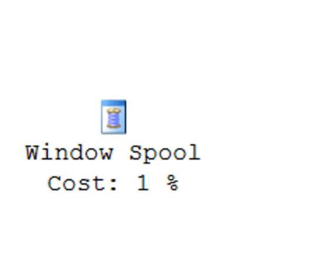
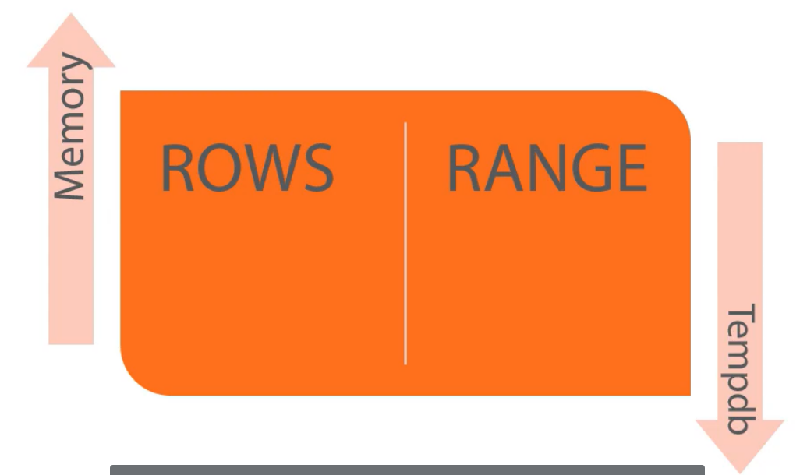
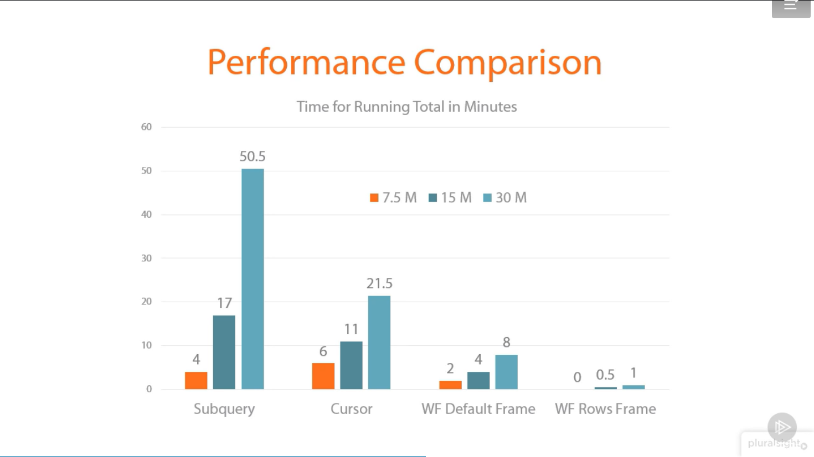
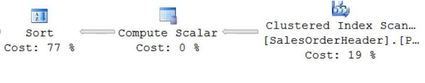

# Windows Functions 
* Operate over set of rows 
* Always have an OVER clause

## Where I can add Windows function?
| May Appear In                      | Cant Found In                                                            |
|------------------------------------|--------------------------------------------------------------------------|
| - SELECT List<br>- ORDER By clause | - FROM clause<br>- GROUP BY clause <br>- WHERE clause<br>- HAVING clause |

## What problems windows function solve?
* Aggregate with no GROUP By becuase group By prevent access individual row
* Anlytics function
* Pull values for other row

## The OVER Clause
* ORDER by
    - when using lag order by is required
* Partiton BY
    - always suported and always optional
* Framing
    - more granular windows smaller than partion (sql server 2012)

LAGE CODE:
    ``` sql
        LAG(<column you need>)
        OVER([<PARTION BY Experssion>] ORDER BY <experssion>)

        LAG(ClosePrice)
        OVER(PARTION BY TickerSymbol ORDER BY TradeDate)

        NOTE: PARTION BY is optional and order by with lag is required 
        
    ```
## Ranking Functions
* ROW_NUMBER 
    - An incrementing number unique witin a partition
* RANK
    - The rank of order by values within a partion
    - if the order by expression is not unique then rank will repeate the rank for those rows withduplicate values in the order by
* DENSE_RANK
    - very similar to RANK the diffrence it returns the next possible rank
* NTILE 

## Aggregation Functions
### Suported Aggregate functions
sum, avg, count, count_big, min, max
checksum_agg, stdev, stdevp, var, vap

* The ORDER BY clause does not suported in SQL server 2005 functionality


* HINT:
    ![])(./media/runtime.png)
    
    some times windows functions have pretty bad performance whenever the OVER clauses are diffrent in the same query

#### Table spool Operator?
this represent the work table created in the tampdb in oreder to do the calculation


## Framing
Framing is part of OVer Clause, start with sql server 2012 
Framing alowing to define spacific part of partition

The frame start with word rows OR Range

Frameing Terms: 
* Current Row  
* Unbounded Preceding (from the start of the partition)
* Unbounded Fllowing (the last row of the partition)
* Between 
* N Preceding
* N Following

As a best practice always specify a frame using rows whenever frame is suported

## Accumulating Windows Aggregates 
Aggrefation functions start suported in 2005

No Order By Clasue Allowed : you dont need order to calculate sum or avg
in 2012 start support With Order by cluase, in 2012 adding ORDER BY Cluase gives you completely different functionality 

syntax :
``` sql
AggregateFunction(<expression>)
OVER([PARTITION BY <expression>] ORDER BY <expression> [ROWS | RANGE <expression>])

DEFAULT FRAME: RANGE BETWEEN UNBOUNDED PRECEDING AND CURRENT ROW
```


## Performance
window spool :


This refercs to a work table that was created to help with calculations, usually created in memory, it's not effected by blocks or locking it's almost magic.
sometimes the worktable created in tempdb and performance is much worse
- there is no way to look at execution plan to know where worktable created

just bear in mind:
when the frame wis build with rows most of the time the worktable created in memory.
When range is used the worktable always created in tempdb, the SQL Server cannot know how many rows in will be needed in the work table with range because range is a logical operator, some times when rows used with large frame worktable created in tempdb

- the way to tell whether worktable is created by viewing STATISTICS IO
    - When worktable created in memory you will see zero for the logical read 
    - when it's created in tempdb the logical reader will be much higher


### performance comparison



## Retriving Data From other rows
### Offset function (released with sql server 2012)
* LAG
* LEAD
* FIRST_VALUE
* LAST_VALUE

LAG and LEAD
- include a column from onother row
- LAG : Previous row
- LEAD : Next row
- ORDER BY required
- No frame

Syntax:
``` sql
    LAG | LEAD(<expression>)
    OVER([PARTITION BY <expression>] ORDER BY <expression>)

    LAG | LEAD(<expression> [,<offset>][,<defualt>])
    OVER([PARTITION BY <expression>] ORDER BY <expression>)
```

FIRST_VALUE and LAST_VALUE:
- first or last row of partition
- FIRST_VALUE retrive from the first row
- LAST_VALUE retrive from the last row
- ORDER BY required
- frame is required
- if frame didnt specified the defualt frame : RANGE BETWEEN UNBOUNDED PRECEDING AND CURRENT ROW


HINT:
``` sql
    DECLARE @offset INT = 1
    select ----
    LAG(saledorderid, @offset) OVER(ORDER BY SalesOrederID) as PrevOver
    FROM ----

```
the logical read for worktable will be much higher because SQL Server cant determine the number of rows in the window until execution time. then it created worktable in tempdb which has much worse performance than if it was created in memory 

HINT :


if the sort operation is much higher, create index will reduce the number of logical read for table and increase preformance


## Using Statistics Functions (analytic functions)
* PERCENT_RANK -> Calculate the rank over the group
* CUM_DIST -> Calculate the realtive position
* PERCENTILE_CONT(continous)
* PERCENTILE_DISC(discrete)

USAGE: 
``` SQL
    PERCEN_RANK | CUM_DIST() 
    OVER([PARTITION BY <expression>] ORDER BY <expression>)
```
- ORDER BY required because in order to rank somthing it must be ordered first

Formula
PERCENT_RANK : (RANK -1) / (N -1)
CUM_DIST : RANK/N


PERCENT_CONT and PERCENT_DISC
``` SQL
    PERCENT_CONT | PERCENT_DISC (<rank>)
    WITHIN GROUP(ORDER BY <expression>)
    OVER([PARTITION BY <expression>])
```
over does not take order by , it doest not support a frame

