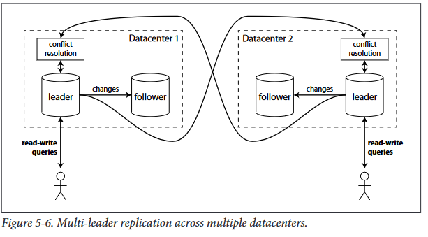
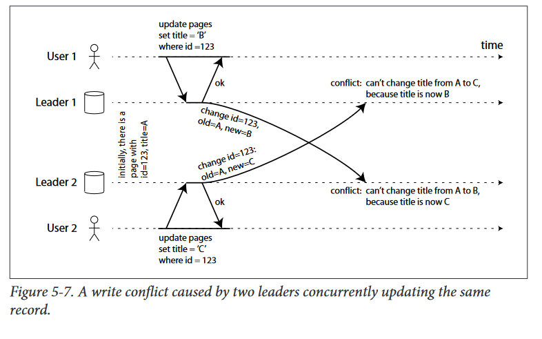

# Multi-leader replication
A natural extension of the leader-based replication model is to allow more than one
node to accept writes. Replication still happens in the same way: each node that processes  a  write  must  forward  that  data  change  to  all  the  other  nodes.  We  call  this  a
multi-leader configuration (also known as master-master replication or active/active).
In this setup, each leader simultaneously acts as a follower to the other leaders

## Use cases for multi-leader replication
It  rarely  makes  sense  to  use  a  multi-leader  setup  within  a  single  datacenter,  because
the  benefits  rarely  outweigh  the  added  complexity.  However,  there  are  some  situa‐
tions in which this is a reasonable configuration.

### Multi-datacenter operation
In a multi-leader configuration, you can have a leader in each datacenter

#### Performance
-   In  a  single-leader  configuration: every  write  must  go  over  the  internet  to  the datacenter with the leader. This can add significant latency to writes
-   In  a multi-leader  configuration:  every  write  can  be  processed  in  the  local  datacenter,
and is replicated asynchronously to the other datacenters. Thus the inter-
datacenter  network  delay  is  hidden  from  users.

#### Tolerance of datacenter outages
#### Tolerance of network problems

Some  database  support  a  multi-leader  configuration  by  default,  but  it  is  also  often
implemented with external tools, such as Tungsten Replicator for MySQL, BDR
for PostgreSQL, and GoldenGate for Oracle 

### Clients with offline operation
Another  situation  in  which  multi-leader  replication  is  appropriate  is  if  you  have  an
application that needs to continue to work while it is disconnected from the internet.

There are tools which aim to make this kind of multi-leader configuration easier. For
example, CouchDB is designed for this mode of operation

### Collaborative editing
Real-time  collaborative  editing  applications  allow  several  people  to  edit  a  document
simultaneously. For example, Etherpad and Google Docs.
allow several people to concurrently edit a text document or spreadsheet (the algorithm is briefly dis‐
cussed in “Automatic conflict resolution” on page 167).

## Handling write conflicts
The  biggest  problem  with  multi-leader  replication  is  that  write  conflicts  can  occur,
which means that conflict resolution is required.

**For example**, consider a wiki page that is simultaneously being edited by two users, as
shown  in  Figure  5-7.  User  1  changes  the  title  of  the  page  from  A  to  B,  and  user  2
changes  the  title  from  A  to  C  at  the  same  time.  Each  user’s  change  is  successfully
applied to their local leader. However, when the changes are asynchronously replica‐
ted,  a  conflict  is  detected  [28].  This  problem  does  not  occur  in  a  single-leader  data‐
base.

### Synchronous vs. asynchronous conflict detection
in  a  multi-leader  setup,  both  writes  are  successful,  and  the  con‐
flict is only detected asynchronously at some later point in time. At that time, it may
be too late to ask the user to resolve the conflict.

In  principle,  you  could  make  the  conflict  detection  synchronous,  i.e.  wait  for  the
write to be replicated to all replicas before telling the user that the write was success‐
ful. However, by doing so, you would lose the main advantage of multi-leader repli‐
cation

### Conflict avoidance
### Converging towards a consistent state
### Custom conflict resolution logic