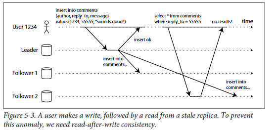
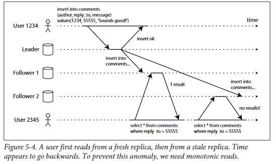
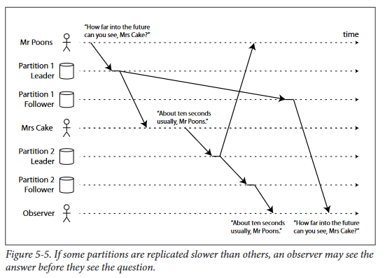

# Problems With Replication Lag
In  this  section  we  will  highlight  three
examples of problems that are likely to occur when there is replication lag, and out‐
line some approaches to solving them

## Reading your own writes consistency  
Many applications let the user submit some data, and then view what they have sub‐
mitted. This might be a record in a customer database, or a comment on a discussion
thread, or something of that sort. When new data is submitted, it must be sent to the
leader, but when the user views the data, it can be read from a follower. This is espe‐
cially appropriate if data is frequently viewed, but only occasionally written.

In this situation, we need read-after-write consistency, also known as read-your-writes
consistency

#### How  can  we  implement  read-after-write  consistency  in  a  system  with  leader-based replication?
There are various possible techniques, to mention a few:
* When  reading  something  that  the  user  may  have  modified,  read  it  from  the leader
    - For example, user profile information on a social network is normally only editable by the only owner of the profile, not by anybody else. 
* If most things in the application are potentially editable by the user
    -  For example, you could track the time  of  the  last  update;  for  one  minute  after  the  last  update,  all  reads are made from  the  leader.
* Another  approach:  the  client  can  remember  the  timestamp  of  its  most  recent write — then  the  system  can  ensure  that  the  replica  serving  any  reads  for  that user  reflects  updates  at  least  until  that  timestamp.  If  a  replica  is  not  sufficiently up-to-date,  the  read  can  either  be  handled  by  another  replica,  or  the  query  can wait until the replica has caught up
    -   The timestamp could be a logical timestamp (something  that  indicates  ordering  of  writes,  such  as  the  log  sequence  number) [Distributed Systems 5.1: Replication by Martin Kleppmann](https://www.youtube.com/watch?v=mBUCF1WGI_I)
* If  your  replicas  are  distributed  across  multiple  datacenters

## Monotonic reads
that can occur when reading from asynchronous followers: it’s possible for a user to see things moving backwards in time.

This  can  happen  if  a  user  makes  several  reads  from  different  replicas.  For  example,
Figure 5-4 shows user 2345 making the same query twice, first to a follower with little
lag,  then  to  a  follower  with  greater  lag.  (This  scenario  is  quite  likely  if  the  user
refreshes a web page, and each request is routed to a random server.) The first query
returns  a  comment  that  was  recently  added  by  user  1234,  but  the  second  query
doesn’t return anything, because the lagging follower has not yet picked up that write.
In effect, the second query is observing the system at an earlier point in time than the
first query. It wouldn’t be so bad if the first query hadn’t returned anything, because
user  2345  probably  wouldn’t  know  that  user  1234  has  recently  added  a  comment.
However,  it’s  very  confusing  for  user  2345  if  they  first  see  user  1234’s  comment
appear, and then see it disappear again

solution: One  way  of  achieving  monotonic  reads  is  to  make  sure  that  each  user  always  makes
their  reads  from  the  same  replica  (different  users  can  read  from  different  replicas).
For example, the replica can be chosen based on a hash of their user ID, rather than
randomly.

## Consistent prefix reads

Preventing this kind of anomaly requires another type of guarantee: consistent prefix reads. This guarantee says that if a sequence of writes happens in a certain order, then anyone reading those writes will see them appear in the same order

One solution is to make sure that any writes which are causally related to each other
are  written  to  the  same  partition but  in  some  applications  that  can’t  be  done  efficiently.  In  general,  ensuring  consistent  prefix  reads  requires  a  kind  of  distributed
transaction with a guarantee such as snapshot isolation.

## Solutions for replication lag
When working with an eventually consistent system, it is worth thinking about how
the  application  behaves  if  the  replication  lag  increases  to  several  minutes  or  even
hours. If the answer is “no problem”, that’s great. However, if the result is a bad experience for users, it’s important to design the system to provide a stronger guarantee, such as read-after-write. Pretending that replication is synchronous, when in fact it is asynchronous, is a recipe for problems down the line.
