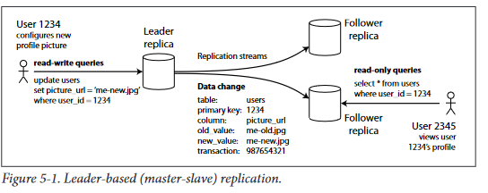
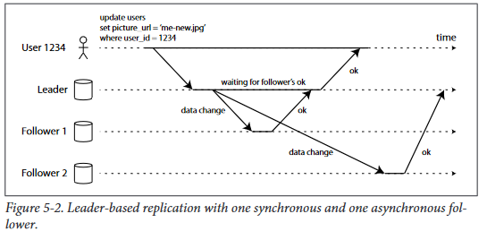

# Replication
Replication  means  keeping  a  copy  of  the  same  data  on  multiple  machines  that  are
connected via a network.

###  why you might want to replicate data ? 
* To keep data geographically close to your users (and thus reduce latency).
* To  allow  the  system  to  continue  working  even  if  some  parts  of  the  system  have failed (and thus increase availability).
* To  scale  out  the  number  of  machines  that  can  serve  read  queries  (and  thus increase read throughput).

If the data that you’re replicating does not change over time, then replication is easy:
you  just  need  to  copy  the  data  to  every  node  once,  and  you’re  done.  All  of  the  difficulty  in  replication  lies  in  handling  changes  to  replicated  data

###  three  popular  algorithms  for  replicating  changes between  nodes
*   single-leader replication
*   multi-leade replication
*   leaderless replication

## Leaders and Followers
It works as follows:
*   One  of  the  replicas  is  designated  the  leader  (also  known  as  master  or  primary).
When  clients  want  to  write  to  the  database,  they  must  send  their  request  to  the
leader, which first writes the new data to its local storage
*   The other replicas are known as followers (read replicas, slaves, or hot standbysi).
Whenever  the  leader  writes  new  data  to  its  local  storage,  it  also  sends  the  data
change  to  all  of  its  followers  as  part  of  a  replication  log  or  change  stream.  Each
follower  takes  the  log  from  the  leader  and  updates  its  local  copy  of  the  database
*   When a client wants to read from the database, it can query either the leader or
any of the followers. However, writes are only accepted on the leader (the follow‐
ers are read-only from the client’s point of view).

###  Synchronous vs. asynchronous replication
example: the  replication  to  follower  1  is  synchronous:  the  leader
waits until follower 1 has confirmed that it received the write before reporting success
to  the  user,  and  before  making  the  write  visible  to  other  clients.  The  replication  to follower  2  is  asynchronous:  the  leader  sends  the  message,  but  doesn’t  wait  for  a
response from the follower.

* The  advantage  of  synchronous  replication  is  that  the  follower  is  guaranteed  to  have an  up-to-date  copy  of  the  data  that  is  consistent  with  the  leader., If  the  leader  sud‐
denly  fails,  we  can  be  sure  that  the  data  is  still  available  on  the  followe 
* The  disadvantage  is  that  if  the  synchronous  follower  doesn’t  respond  (because  it  has  crashed,
or  there  is  a  network  fault,  or  for  any  other  reason),

#### semi-sync
It  is  impractical  for  all  followers  to  be  synchronous:  any  one  node
outage would cause the whole system to grind to a halt. In practice, if you enable syn‐
chronous replication on a database, it usually means that one of the followers is syn‐
chronous,  and  the  others  are  asynchronous.  If  the  synchronous  follower  becomes
unavailable  or  goes  slow,  one  of  the  asynchronous  followers  is  made  synchronous.
This  guarantees  that  you  have  an  up-to-date  copy  of  the  data  on  at  least  two  nodes:
the leader and one synchronous follower. This configuration is sometimes also called
semi-synchronous

leader-based  replication  is  configured  to  be  completely  asynchronous.  In  this
case, if the leader fails and is not recoverable, any writes that have not yet been repli‐
cated  to  followers  are  lost.  This  means  that  a  write  is  not  guaranteed  to  be  durable,
even if it has been confirmed to the client

### Setting up new followers
From time to time, you need to set up new followers — perhaps to increase the num‐
ber  of  replicas,  or  to  replace  failed  nodes

*   Take  a  consistent  snapshot  of  the  leader’s  database  at  some  point  in  time — if
possible,  without  taking  a  lock  on  the  entire  database. 
*   Copy the snapshot to the new follower node
*   The follower connects to the leader, and requests all data changes that happened since  the  snapshot  was  taken.  This  requires  that  the  snapshot  is  associated  with an exact position in the leader’s replication log 
    -   That position has various different  names:  for  example,  PostgreSQL  calls  it  log  sequence  number,  and  MySQL calls it binlog coordinates   
*   When the follower has processed the backlog of data changes since the snapshot, we  say  it  has  caught  up.  It  can  now  continue  to  process  data  changes  from  the leader as they happen.

### Handling node outages
Any node in the system can go down, perhaps unexpectedly due to a fault, but just as
likely due to planned maintenance (for example, rebooting a machine to install a ker‐
nel security patch)
#### Follower failure: catch-up recovery
The  follower  can  recover  quite  easily:
from  its  log,  it  knows  the  last  transaction  that  was  processed  before  the  fault  occur‐
red.  Thus  the  follower  can  connect  to  the  leader,  and  request  all  data  changes  that
occurred  during  the  time  when  the  follower  was  disconnected. 

#### Leader failure: failover
*   Handling a failure of the leader is trickier
    - one of the followers needs to be promoted to  be  the  new  leader
    - clients  need  to  be  reconfigured  to  send  their  writes  to  the  new leader
    - and  the  other  followers  need  to  start  consuming  data  changes  from  the  new leader

#####  An automatic failover process usually consists of the following steps:
*   Determining  that  the  leader  has  failed
*   Choosing a new leader (This could either be an election process)
*   Reconfiguring  the  system  to  use  the  new  leader (The  system  needs  to  ensure that the old leader becomes a follower and recognizes the new leade)

##### Failover is fraught with things that can go wrong:
it depends if replication is asynchronous or synchronous  read **page 151** very very important information
* There  are  no  easy  solutions  to  these  problems.  For  this  reason,  some  operations
teams  prefer  to  perform  failover  manually,  even  if  the  software  supports  automatic
failover.

### Implementation of replication logs
*   Statement-based replication
*   Write-ahead log (WAL) shipping
*   Logical log replication
*   Trigger-based replication

#### Statement-based replication
In  the  simplest  case,  the  leader  logs  every  write  request  (statement)  that  it  executes,
and  sends  that  statement  log  to  its  followers.  For  a  relational  database,  this  means
that  every  insert,  update  or  delete  statement  is  forwarded  to  followers,  and  each  fol‐
lower parses and executes that SQL statement as if it had been received from a client.

##### There  are  various  ways  in  which  this  approach to replication can break down:
*   Any  statement  that  calls  a  non-deterministic  function,  for  example  NOW()  to  get the current date and time, or RAND() to get a random number
*   If statements use an auto-incrementing column, or if they depend on the existing
data  in  the  database  (e.g.  UPDATE ... WHERE <some condition>),  they  must  be
executed  in  exactly  the  same  order  on  each  replica
*   Statements  that  have  side-effects  (e.g.  triggers,  stored  procedures,  user-defined
functions) 

#### Write-ahead log (WAL) shipping
*   In  the  case  of  a  log-structured  storage  engine  (see  “SSTables  and  LSM-trees”  on
page 74), this log is the main place for storage. Log segments are compacted and
garbage-collected in the background.
*   In  the  case  of  a  B-tree  (see  “B-trees”  on  page  77),  which  overwrites  individual
disk blocks, every modification is first written to a write-ahead log (WAL) so that
the index can be restored to a consistent state after a crash.

the log is an append-only sequence of bytes containing all writes to the
database.  We  can  use  the  exact  same  log  to  build  a  replica  on  another  node:  besides
writing  the  log  to  disk,  the  leader  also  sends  it  across  the  network  to  its  followers.
When  the  follower  processes  this  log,  it  builds  a  copy  of  the  exact  same  data  struc‐
tures as found on the leader.
#### Logical log replication (row-based replication)
An  alternative  is  to  use  different  log  formats  for  replication  and  for  the  storage
engine. This allows the replication log to be decoupled from the storage engine internals

##### A  logical  log  for  a  relational  database  is  usually  a  sequence  of  records  describingwrites to database tables at the granularity of a row:
* For an inserted row, the log contains the new values of all columns
* For  a  deleted  row,  the  log  contains  enough  information  to  uniquely  identify  the
row that was deleted. Typically this would be the primary key, but if there is no
primary key on the table, the old values of all columns need to be logged
* For  an  updated  row,  the  log  contains  enough  information  to  uniquely  identify
the updated row

Since  a  logical  log  is  decoupled  from  the  storage  engine  internals,  it  can  more  easily
be  kept  backwards-compatible

A  logical  log  format  is  also  easier  for  external  applications  to  parse.  This  is  useful  if
you  want  to  send  the  contents  of  a  database  to  an  external  system,
*   such  as  a  data warehouse for offline analysis
*   for building custom indexes and caches. This is called change data capture

#### Trigger-based replication
Trigger-based replication typically has greater overheads than other replication
methods, and is more prone to bugs and limitations than the database’s built-in repli‐
cation. However, it can nevertheless be useful due to its flexibility
