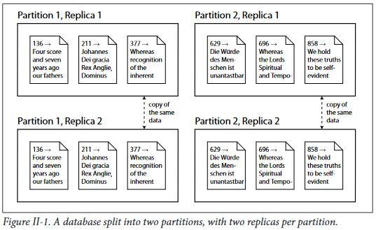

## Scaling to Higher Load
* If all you need is to scale to higher load, the simplest approach is to buy a more pow‐
erful  machine  (sometimes  called  vertical  scaling  or  scaling  up)
many RAM chips and many disks can be joined together under one operating system
#### shared-nothing, shared-disk and shared memory

### Shared-Nothing Architectures
shared-nothing  architectures (sometimes  called  horizontal  scaling  or
scaling out) have gained a lot of popularity.
* In this approach, each machine or virtual machine  running  the  database  software  is  called  a  node.
* Each  node  uses  its  CPUs, RAM and disks independently.
* Any coordination between nodes is done at the software level, using a conventional network.
## Replication vs. partitioning
There are two common ways data is distributed across multiple nodes:
*   **Replication:**
    -   Keeping a copy of the same data on several different nodes, potentially in different  locations.Replication  provides  redundancy:  if  some  nodes  are  unavailable, the  data  can  still  be  served  from  the  remaining  nodes.  Replication  can  also  help improve performance.
*   **Partitioning:**
    -   Splitting  a  big  database  into  smaller  subsets  called  partitions,  so  that  different partitions  can  be  assigned  to  different  nodes  (also  known  as  sharding).
    
These  are  separate  mechanisms,  but  they  often  go  hand  in  hand,  as  illustrated

   
