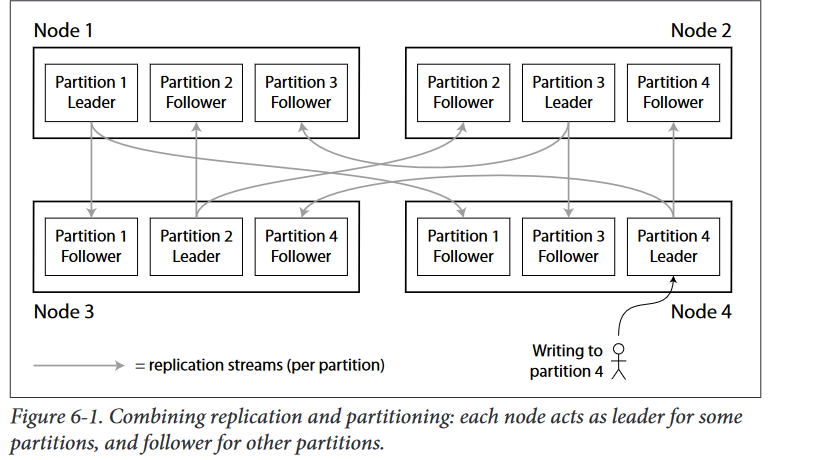
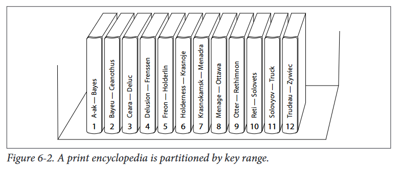

# Partitioning and replication
-   Partitioning is usually combined with replication
-   A  node  may  store  more  than  one  partition

## Partitioning of key-value data
Say you have a large amount of data, and you want to partition it. How do you decide which records to store on which node?
Our  goal  with  partitioning  is  to  spread  the  data  and  the  query  load  evenly  across nodes. 

- If  the  partitioning  is  unfair,  so  that  some  partitions  have  more  data  or  queries  than others,  we  call  it  *skewed*.
- A partition with disproportionately high load is called a *hot spot*

#### Solve HotSpot 
The simplest approach of avoiding hot spots would be to assign records to nodes randomly.  That  would  distribute  the  data  quite  evenly  across  the  nodes,  but  has  a  big disadvantage: when you’re trying to read a particular item, you have no way of knowing which node it is on, so you would have to query all nodes in parallel.

##### Example:
Let’s assume for now that you have a simple key-value data model,
in  which  you  always  access  a  record  by  its  primary  key.  For  example,  in  an  old-
fashioned  paper  encyclopedia,  you  look  up  an  entry  by  its  title;  since  all  the  entries
are alphabetically sorted by title, you can quickly find the one you’re looking for.

