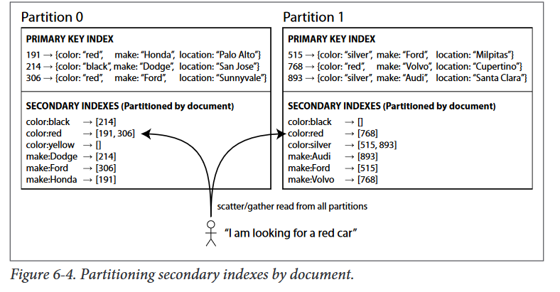

# Partitioning and secondary indexes
The partitioning schemes we have discussed so far rely on a key-value data model. If
records  are  only  ever  accessed  via  their  primary  key,  we  can  determine  the  partition
from that key, and use it to route read and write requests to the partition responsible
for that key

Secondary indexes are the bread and butter of relational databases, and they are com‐
mon in document databases too. NoSQL key-value stores (such as HBase and Volde‐
mort) have avoided secondary indexes because of their added implementation
complexity,  but  some  (such  as  Riak)  have  started  adding  them  because  they  are  so useful  for  data  modeling.  And  finally,  secondary  indexes  are  the  raison  d’être  of
search servers such as Solr and Elasticsearch

The  problem  with  secondary  indexes  is  that  they  don’t  map  neatly  to  partitions.
There  are  two  main  approaches  to  partitioning  a  database  with  secondary  indexes:
document-based partitioning and term-based partitioning.
