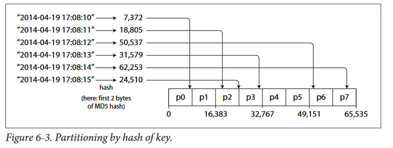

# Partitioning by key range
If  you  know  the  boundaries  between  the  ranges,  you  can  easily  deter‐
mine  which  partition  contains  a  given  key.  If  you  also  know  which  partition  is
assigned  to  which  node,  then  you  can  make  your  request  directly  to  the  appropriate
node
* The partition boundaries might be chosen manually by an administrator, or the database can choose them automatically
* Within  each  partition,  we  can  keep  keys  in  sorted  order 
* can treat the key as a concatenated index in order to fetch several related records in one query(see  “Multi-column  indexes”  on page  84).
* the  downside  of  key  range  partitioning  is  that  certain  access  patterns  can lead to hot spots

### Partitioning by hash of key
Because  of  this  risk  of  skew  and  hot  spots,  many  distributed  datastores  use  a  hash function to determine the partition for a given key.

##### HINT
Unfortunately, by using the hash of the key for partitioning, we also lost a nice prop‐
erty of key-range partitioning: the ability to do efficient range queries. Keys that were
once adjacent are now scattered across all the partitions, so their sort order is lost. In
MongoDB, if you have enabled hash-based sharding mode, any range query has to be
sent to all partitions
-   Range queries on the primary key are not supported by Riak, Couchbase and Voldemor
-   Cassandra  achieves  a  compromise  between  the  two  partitioning  strategies  [10,  11,
12]. A table in Cassandra can be declared with a compound primary key consisting of
several  columns.  Only  the  first  part  of  that  key  is  hashed  to  determine  the  partition,
but  the  other  columns  are  used  as  a  concatenated  index  for  sorting  the  data  in  Cas‐
sandra’s SSTables

### Skewed workloads and relieving hot spots