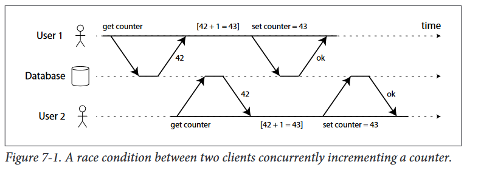

# The slippery concept of a transaction
The safety guarantees provided by transactions are often described by the well-
known acronym ACID, which stands for Atomicity, Consistency, Isolation and Dura‐
bility.
Systems that do not meet the ACID criteria are sometimes called BASE which stands for Basically Available Soft state and Eventual consistency 
## The meaning of ACID
### Atomicity
In general, atomic refers to something that cannot be broken down into smaller parts.
For example, in multithreaded programming, if one thread executes an atomic
operation, that means there is no way that another thread could see the half-finished
result of the operation.

### Consistency
The idea of ACID consistency is that you have certain statements about your data
(invariants) that must always be true — for example, in an accounting system, credits
and debits across all accounts must always be balanced. If a transaction starts with a
database that is valid according to these invariants, and any writes during the transac‐
tion preserve the validity, then you can be sure that the invariants are always satisfied

### Isolation
Most databases are accessed by several clients at the same time. That is no problem if
they are reading and writing different parts of the database, but if they are accessing
the same database records, you can run into concurrency problems (race conditions).
- Isolation in the sense of ACID means that concurrently executing transactions are
isolated from each other
in practice, serializable isolation is rarely used, because it carries a perfor‐
mance penalty. Some popular databases such as Oracle 11g don’t even implement it.
In Oracle,

### Durability
The purpose of a database system is to provide a safe place where data can be stored
without fear of losing it. Durability is the promise that once a transaction has committed successfully, any data it has written will not be forgotten, even if there is a
hardware fault or the database crashes
#### Examples:
- On a single-node database, this typically means that the data has been written to nonvolatile storage such as a hard drive or SSD. It usually also involves a write-ahead log which allows recovery in case the data structures on disk are corrupted. 
- In a replicated database,durability may mean that the data has been successfully copied to some number of
nodes. In order to provide a durability guarantee, a database must wait until these writes or replications are complete before reporting a transaction as successfully committed.

## Single-object and multi-object operations
Atomicity ensures that if an error occurs, any prior writes from that trans‐
action are undone, to avoid an inconsistent state

Multi-object transactions require some way of determining which read and write
operations belong to the same transaction. In relational databases, that is typically
done based on the client’s TCP connection to the database server: on any particular
connection, everything between a BEGIN TRANSACTION and a COMMIT statement is
considered to be part of the same transaction

On the other hand, many non-relational databases don’t have such a way of grouping
operations together. 

### Single-object writes
Atomicity and isolation also apply when a single object is being changed. For exam‐
ple, imagine you are writing a 20 kB JSON document to a database:

-   If the network connection is interrupted after the first 10 kB have been sent, does
the database store that unparseable 10 kB fragment of JSON?
-    If the power fails while the database is in the middle of overwriting the previous
value on disk, do you end up with the old and the new value spliced together?
-   If another client reads that document while the write is in progress, will it see a
partially updated value?

### The need for multi-object transactions
Many distributed datastores have abandoned multi-object transactions because they
are difficult to implement across partitions, and they can get in the way in some scenarios where very high availability or performance are required.

do we need multi-object transactions at all? Would it be possible to implement
any application with only a key-value data model and single-object operations?
There are some use cases in which single-object inserts, updates and deletes are suffi‐
cient. However, in many other cases you need writes to several different objects need
to be coordinated:
when inserting several records that refer to each other, the
- foreign keys have to be correct and up-to-date, otherwise the data becomes non‐
sensical.
- In a document data model, the fields that need to be updated together are often
within the same document, which is treated as a single object no multi-object transactions are needed when updating a single document. 

### Handling errors and aborts
- A key feature of a transaction is that in the case of a problem, it can be aborted and retried
- If the database is in danger of
violating its guarantee of atomicity, isolation or durability, it would rather abandon
the transaction entirely than allow it to continue.
- Not all systems follow that philosophy: especially datastores with leaderless replication

- Errors will inevitably happen, but many software developers prefer to think only
about the happy path rather than the intricacies of error handling. For example, popular object-relational mapping (ORM) frameworks such as Rails’ ActiveRecord and
Django don’t retry aborted transactions 

- Although retrying an aborted transaction is a simple and effective error handling
mechanism, it isn’t perfect:
    - Only transient errors (for example due to deadlock, isolation violation, tempo‐
    rary network interruptions and failover) are worth retrying; retrying a perma‐
    nent error (e.g. constraint violation) would be pointless
    - f the transaction also has side-effects outside of the database, those side-effects
may happen even if the transaction is aborted. For example, if you’re sending an
email, you wouldn’t want to send the email again every time you retry the trans‐
action. If you want to make sure that several different systems either commit or
abort together, 2-phase commit can help (which we will discuss in “Atomic com‐
mit and two-phase commit (2PC)” on page 344)

