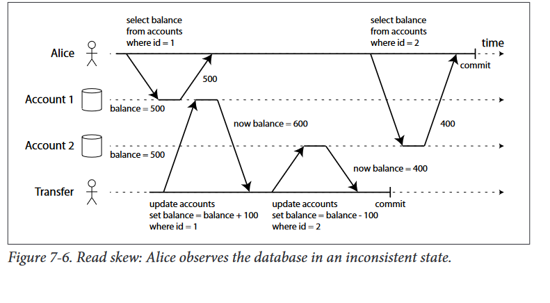
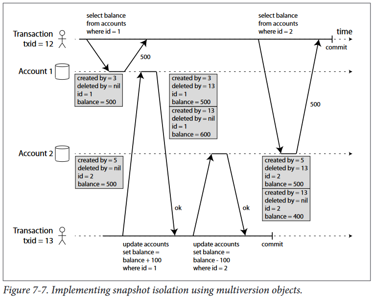

# Weak isolation levels
## Read committed
The most basic level of transaction isolation is read committed.v It makes two guarantees:
-   When reading from the database, you will only see data that has been committed(no dirty reads).
-   When writing to the database, you will only overwrite data that has been committed (no dirty writes)

### No dirty reads
Imagine one transaction has written some data to the database, but has not yet com‐
mitted or aborted. Can another transaction see that uncommitted data? If yes, that is
called a dirty read
If the earlier write is part of a transaction that has not yet
committed, so the later write overwrites an uncommitted value? This is called a dirty
write

### Implementing read committed
Read committed is a very popular isolation level. It is the default setting in Oracle
11g, PostgreSQL, SQL Server 2012, MemSQL and many other databases

## Snapshot isolation and repeatable read
At the time of writing, the only mainstream databases that use locks for read committed isolation are IBM
DB2, and Microsoft SQL Server in the read_committed_snapshot=off configuration 

This anomaly is called a non-repeatable read or read skew

If Alice reloads the online banking website a few seconds later, the $100 will most
likely have reappeared, so it’s not a lasting problem. However, some situations cannot
tolerate such temporary inconsistency:
- Backups
    Taking a backup requires making a copy of the entire database, which may take
hours on a large database. During the time that the backup process is running,
writes will continue to be made to the database. Thus, you could end up with
some parts of the backup containing an older version of the data, and other parts
containing a newer version. If you need to restore from such a backup, the
inconsistencies (such as disappearing money) become permanent.
-   Analytic queries and integrity checks

Snapshot isolation , also known as multiversion concurrency control (MVCC)

### Implementing snapshot isolation
Snapshot isolation is a popular feature: it is supported by PostgreSQL, MySQL with
the InnoDB storage engine, Oracle, SQL Server, and more 

Like read committed, implementations of snapshot isolation typically use write locks
to prevent dirty writes. 
However, locks are not required for reads. From
a performance point of view, a key principle of snapshot isolation is readers never
block writers, and writers never block readers 

This is implemented as a generalization of the mechanism we saw for preventing
dirty reads in Figure. In order to prevent dirty reads, the database needs to keep
at most two versions of an object: the committed version, and the overwritten-but-
not-yet-committed version. For snapshot isolation, the database must potentially
keep several different committed versions of an object, because various in-progress
transactions may need to see the state of the database at different points in time.
Hence snapshot isolation is also known as a multiversion technique
#### how snapshot isolation is implemented ?
In PostgreSQL (other implementations are similar). When a transaction is started, it is given a
unique, always-increasingvii transaction ID. Whenever a transaction writes anything
to the database, the data it writes is tagged with the transaction ID of the writer
>
To be precise, transaction IDs are 32-bit integers, so they overflow after approximately 4 billion transac‐
tions. PostgreSQL’s vacuum process performs cleanup which ensures that overflow does not affect the data.
>

If a transaction deletes a row, the row isn’t actually deleted from the
database, but it is marked for deletion by setting the deleted by field to the ID of the
transaction that requested the deletion. At some later time, when it is certain that no
transaction can any longer access the deleted data, a garbage collection process in the
database removes any rows marked for deletion, and frees their space.

An update is internally translated into a delete and a create. For ex:

### Visibility rules for observing a consistent snapshot
When a transaction reads from the database, transaction IDs are used to decide
which objects a transaction can see, and which are invisible. By carefully defining vis‐
ibility rules, the database can present a consistent snapshot of the database to the
application. This works as follows
- At the start of each transaction, the database makes a list of all the other transac‐
tions which are in progress (not yet committed or aborted) at that time. Any
writes made by one of those transactions are ignored, even if the transaction sub‐
sequently commits.
- any writes made by aborted transactions are ignored
- Any writes made by transactions with a later transaction ID (i.e. which started
after the current transaction started) are ignored, regardless of whether that
transaction has committed.
- all other writes are visible to the application’s queries.

### Indexes and snapshot isolation
How do indexes work in a multiversion database? One option is to have the index
simply point to all versions of an object, and an index query needs to filter out any
object versions that are not visible to the current transaction. When garbage collec‐
tion removes old object versions that are no longer visible to any transaction, the cor‐
responding index entries can also be removed
Another approach is used in CouchDB, Datomic and LMDB. Although they also use
B-trees (see “B-trees” on page 77), they use an append-only/copy-on-write 

which does not overwrite pages of the tree when they are updated, but instead creates
a new copy of each modified page. Parent pages, up to the root of the tree, are copied
and updated to point to the new version of their child pages. Any pages that are not
affected by a write do not need to be copied, and remain immutable [32, 33, 34].
With append-only B-trees, every write transaction (or batch of transactions) creates a
new B-tree root, and a particular root is a consistent snapshot of the database at the
point in time when it was created. There is no need to filter out objects based on
transaction IDs because subsequent writes cannot modify an existing B-tree, only
create new tree roots. However, this approach also requires a background process for
compaction and garbage collection

### Repeatable read and naming confusion

## Preventing lost updates
???????????????????