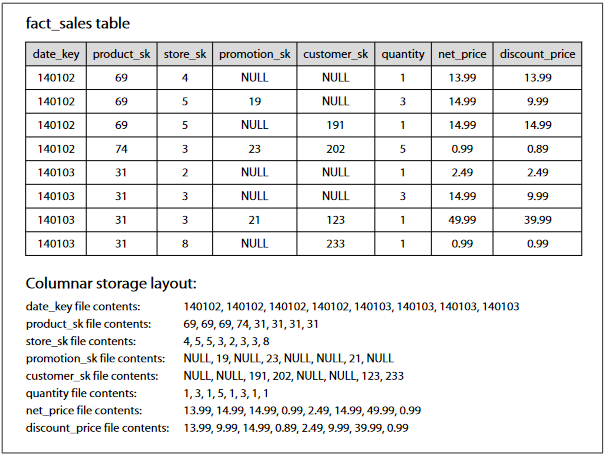

# Column-oriented storage
## Column-oriented storage

### Column compression
Besides  only  loading  those  columns  from  disk  that  are  required  for  a  query,  we  can
further  reduce  the  demands  on  disk  throughput  by  compressing  data.  Fortunately,
column-oriented storage often lends itself very well to compression
### Memory bandwidth and pipelined execution
Besides  reducing  the  volume  of  data  that  needs  to  be  loaded  from  disk,  column-
oriented  storage  layouts  are  also  good  for  making  efficient  use  of  CPU  cycles.  For
example,  the  query  engine  can  take  a  chunk  of  compressed  column  data  that  fits
comfortably  in  the  CPU’s  L1  cache,  and  iterate  through  it  in  a  tight  loop.  This  is
much  faster  than  code  that  requires  a  lot  of  function  calls  and  conditions  for  each
record that is processed. Column compression allows more rows from a column to fit
in  the  same  amount  of  L1  cache.  Operators,  such  as  the  bitwise  AND  and  OR
described  above,  can  be  designed  to  operate  on  such  chunks  of  compressed  column
data directly. This technique is known as vectorized processing 
### Sort order in column storage
In  a  column  store,  it  doesn’t  necessarily  matter  in  which  order  the  rows  are  stored.
It’s easiest to store them in the order in which they were inserted
### Several different sort orders
why not store the same data sorted in several different ways? Data needs to
be replicated to multiple machines anyway, so that you don’t lose data if one machine
fails.  You  might  as  well  store  that  redundant  data  sorted  in  different  ways,  so  that
when you’re processing a query, you can use the version that best fits the query pat‐
tern.
Having multiple sort orders in a column-oriented store is a bit similar to having mul‐
tiple secondary indexes in a row-oriented store. But the big difference is that the row-
oriented store keeps every row in one place (in the heap file or a clustered index), and
secondary  indexes  just  contain  pointers  to  the  matching  rows.  In  a  column  store,
there normally aren’t any pointers to data elsewhere, only columns containing values.

## Writing to column-oriented storage
* column-oriented storage hey have the downside of making writes more difficult.
* An  update-in-place  approach,  like  B-trees  use,  is  not  possible  with  compressed  columns. If you wanted to insert a row in the middle of a sorted table, you would most likely  have  to  rewrite  all  the  column files.  As  rows  are  identified  by  their  position within a column, the insertion has to update all columns consistently
    -   solution: LSM-trees.
All writes first go to an in-memory store, where they are added to a sorted structure,
and  prepared  for  writing  to  disk.  It  doesn’t  matter  whether  the  in-memory  store  is row-oriented  or column-oriented. 
    -   when  enough  writes  have  accumulated,  they  are merged with the column files on disk, and written t new files in bulk. This is essentially 
    -   Queries need to examine both the column data on disk and the recent writes in memory, and combine the two

## Aggregation: Data cubes and materialized views
Not  every  data  warehouse  is  necessarily  a  column  store:  traditional  row-oriented databases and a few other architectures are also use

## SUMMARY

    