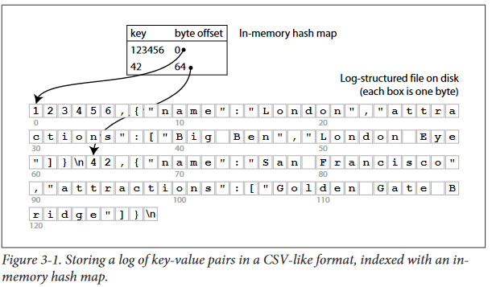
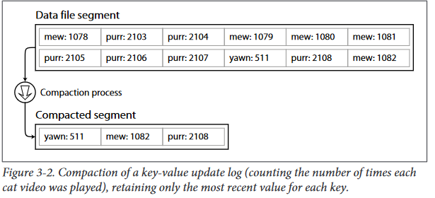
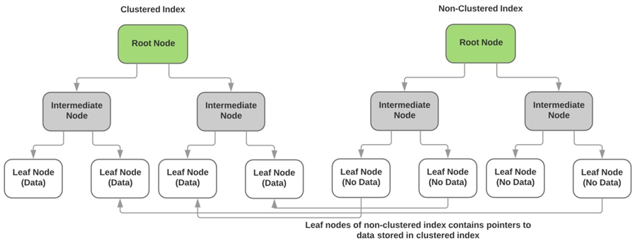

# Data Structures that Power Your Database
## Hash Index
this data struture used in key-value database to leverage the read and write performance 
### how hash index work..?
Whenever you append a new key-value pair to the file, you also update the hash map
to reflect the offset of the data you just wrote (this works both for inserting new keys
and for updating existing keys). When you want to look up a value, use the hash map
to find the offset in the data file, seek to that location, and read the value.


#### How to avoid running out of disk space?
break the log into segments of a certain  size,  and  to  perform  compaction  on  these  segments,  as illustrated Compaction  means  throwing  away  duplicate  keys  in  the  log,  and  keeping  only  the most recent update for each key.

*....read more in the book*

#### The hash table index also has limitations:
*   The  hash  table  must  fit  in  memory,  so  if  you  have  a  very  large  number  of  keys,
you’re  out  of  luck.  In  principle,  you  could  maintain  a  hash  map  on  disk,  but
unfortunately  it  is  difficult  to  make  an  on-disk  hash  map  perform  well.  It
requires a lot of random access I/O, it is expensive to grow when it becomes full,
and hash collisions require fiddly logic
*   Range  queries  are  not  efficient.  For  example,  you  cannot  easily  fetch  the  values
for  all  keys  between  kitty00000  and  kitty99999 — you’d  have  to  look  up  each
key individually in the hash maps.


## SSTables and LSM-trees
Sorted Strings Table (SSTable) is a persistent file format used by Scylla, Apache Cassandra, and other NoSQL databases to take the in-memory data stored in memtables, order it for fast access, and store it on disk in a persistent, ordered, immutable set of files. Immutable means SSTables are never modified. They are later merged into new SSTables or deleted as data is updated.

[More About SSTables...](https://www.scylladb.com/glossary/sstable/)
>
An SSTable uses a Log-Structured Merge (LSM) tree data structure format. This format is more efficient for write-heavy fast-growing extremely large data sets than a traditional B-tree (pronounced “Bee tree”) format.
>

#### how it works?
Maintaining a sorted structure on disk is possible (see next section), but maintaining
it in memory is much easier. There are plenty of well-known tree data structures that
you can use, such as Red-Black trees or AVL trees [2]. With these data structures, you
can insert keys in any order, and read them back in sorted order.
We can now make our storage engine work as follows:
*   When a write comes in, add it to an in-memory balanced tree data structure, for
example a Red-Black tree. This in-memory tree is sometimes called a memtable.
*    When  the  memtable  gets  bigger  than  some  threshold — typically  a  few  mega‐
bytes — write  it  out  to  disk  as  an  SSTable  file.  This  can  be  done  efficiently
because  the  tree  already  maintains  the  key-value  pairs  sorted  by  key.  The  new
SSTable  file  becomes  the  most  recent  segment  of  the  database.  When  the  new
SSTable is ready, the memtable can be emptied.
*    In order to serve a read request, first try to find the key in the memtable, then in
the most recent on-disk segment, then in the next-older segment, etc.
*    From time to time, run a merging and compaction process in the background to
combine segment files and to discard overwritten or deleted values.
>
This  scheme  works  very  well.  It  only  suffers  from  one  problem:  if  the  database
crashes, the most recent writes (which are in the memtable but not yet written out to
disk)  are  lost
>

LSM-tree algorithm can be slow when looking up keys that do not
exist in the database: you have to check the memtable, then the segments all the way
back to the oldest (possibly having to read from disk for each one) before you can be
sure  that  the  key  does  not  exist 
##### Bloom Filter :
A  Bloom  filter  is  a  memory-efficient  data  structure  for
approximating  the  contents  of  a  set.  It  can  tell  you  if  a  key  does  not  appear  in  the
database, and thus saves many unnecessary disk reads for non-existent keys.
**Database use Bloom filter**: [LevelDb](https://github.com/google/leveldb)

## B-Trees
#### the diffrence between b-tree and LSM Tree(*important information*)
* [B-Tree VS LSM Tree](https://tikv.github.io/deep-dive-tikv/key-value-engine/B-Tree-vs-Log-Structured-Merge-Tree.html)
* [B_tree VS lSM Tree Reading and writing Performance](https://blog.yugabyte.com/a-busy-developers-guide-to-database-storage-engines-the-basics/)
#### In order to make the database resilient to crashes
it is normal for B-tree implementations  to  include  an  additional  data  structure  on  disk:  a  write-ahead log  (WAL,  also known  as  redo  log).  This  is  an  append-only  file  to  which  every  B-tree  modification
must be written before it can be applied to the pages of the tree itself. When the database comes back up after a crash, this log is used to restore the B-tree back to a consistent state.

>
A B-tree index must therefore write every piece of data at least twice: once to the log,
and  once  to  the  tree  page  itself
>

### Comparing B-trees to LSM-trees
*   LSM-trees  are  typically  able  to  sustain  much  higher  throughput  of  random  writes
compared  to  B-trees,  because  they  turn  all  random  writes  into  sequential  writes  on
the  underlying  device
*   LSM-trees are typically faster for writes, whereas B-trees  are  thought  to  be  faster  for  read
*   A  downside  of  log-structured  storage  is  that  the  compaction  process  can  sometimes
interfere  with  the  performance  of  ongoing  reads  and  writes.(need more search...)
*   An  advantage  of  B-trees  is  that  each  key  exists  in  exactly  one  place  in  the  index,
whereas a log-structured storage engine may have multiple copies of the same key in
different  segments.  This  makes  B-trees  attractive  in  databases  that  want  to  offer
strong  transactional  semantics
*   In  new  datastores,  log-structured  indexes  are  becoming  increasingly  popular

## Other indexing structures
### Storing values within the index
A compromise between a clustered index (storing all row data within the index) and
a nonclustered index (storing only references to the data within the index) is known
as a covering index or index with included columns

#### HINT
>
[more details about non-clustred index and covering index i did not know](https://www.mssqltips.com/sqlservertutorial/9133/sql-server-nonclustered-indexes/)
>
#### Non-clustered indexes relation to clustered index
the clustered index stores the actual data of the non-key columns in the leaf nodes of the index.  The leaf nodes of each non-clustered index do not contain any data and instead have pointers to the actual data page (or leaf node) of the clustered index.  The diagram below illustrates this point.


>
there are other types of indexs as Multi-column indexes and Multi_dimensional indexes  that use R-tree structure you shoud **Read More About..**
>

#### multi Dimentional index Example
A restaurant search website may have a database containing the latitude and longitude of each res‐
taurant.  When  a  user  is  looking  at  the  restaurants  on  a  map,  the  website  needs  to
search  for  all  the  restaurants  within  the  rectangular  map  area  that  the  user  is  cur‐
rently viewing. This requires a two-dimensional range query like the following:
``` sql
SELECT * FROM restaurants WHERE latitude  > 51.4946 AND latitude  < 51.5079
                            AND longitude > -0.1162 AND longitude < -0.1004;
```
## Keeping everything in memory
### in memory databases
Vendors  such  as  VoltDB,  MemSQL  and  Oracle  TimesTen  are  in-memory  databases
with a relational model, and they claim that they can offer big performance improve‐
ments  by  removing  all  the  overheads  associated  with  managing  on-disk  data  struc‐
tures [35, 36]. RAMCloud is an open-source in-memory key-value store with
durability (using a log-structured approach for the data in memory as well as the data
on disk). **Redis and Couchbase provide weak durability by writing to disk asynchronously.**