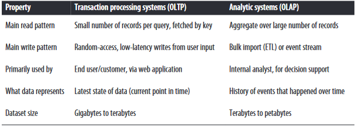
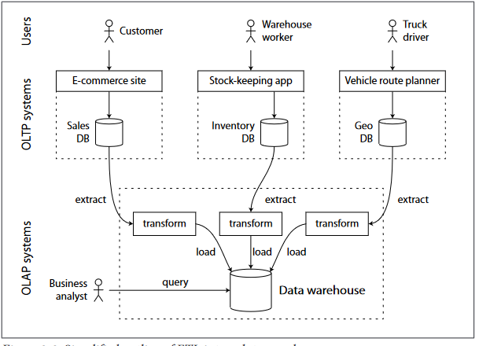

# Transaction Processing or Analytics?
#### Comparing characteristics of transaction-processing versus analytic systems

## Data warehousing
There was a trend for companies to stop using their OLTP systems for analytics purposes, and to run the analytics on a separate database instead. This separate database was called a data warehouse    
#### Extract-Transform-Load (ETL)?
Data is extracted from OLTP databases (using either a periodic data dump or a continuous  stream  of  updates),  transformed  into  an  analysis-friendly  schema,  cleaned up,  and  then  loaded  into  the  data  **warehouse**.  This  process  of  getting  data  into  the

## Stars and snowflakes: schemas for analytics
pass

