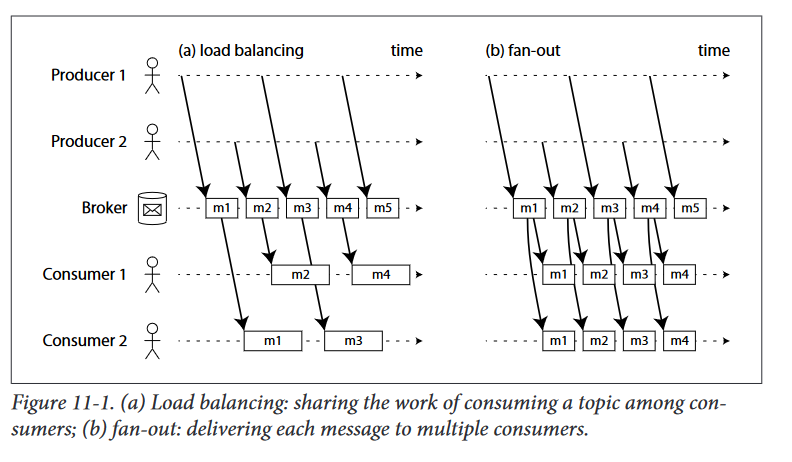
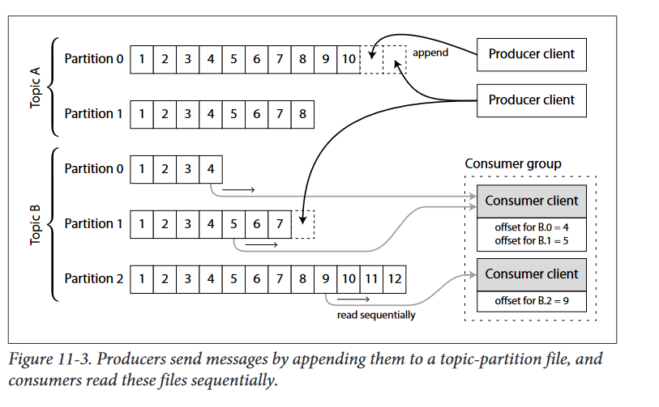

# Transmitting Event Streams
a stream processing context, a record is more
commonly known as an event, but it is essentially the same thing: a small, self-
contained, immutable object containing the details of something that happened at
some point in time. An event usually contains a timestamp indicating when it happened

In batch processing, a file is written once and then potentially read by multiple jobs.
Analogously, in streaming terminology, an event is generated once by a producer
(also known as publisher or sender), and then potentially processed by multiple consumers (subscribers or recipients). In a filesystem, a filename identifies a set of related
records; in a streaming system, related events are usually grouped together into a
topic or stream.

## Messaging systems
A common approach for notifying consumers about new events is to use a messaging
system: a producer sends a message containing the event, which is then pushed to
consumers. 

Within this publish-subscribe model, different systems take a wide range of
approaches,

* What happens if the producers send messages faster than the consumers can pro‐cess them? 
    - Broadly speaking, there are three options: the system can drop messages, buffer messages in a queue, or apply backpressure (block the producerfrom sending more messages). 
    - Example: Unix pipes and TCP use backpressure they have a small fixed-size buffer, and if it fills up, the sender is blocked until the recipient takes data out of the buffer

* What happens if nodes crash or temporarily go offline? Are any messages lost? 
- ...

A nice property of the batch processing systems is that they provide a strong reliability guarantee:
 failed tasks are automatically retried, and partial output from failed tasks is automatically discarded. This means the output is the same as if no failures had occurred, which helps simplify the programming model.

### Direct messaging from producers to consumers
A number of messaging systems use direct network communication between producers and consumers, without going via intermediary nodes:
* UDP multicast is widely used in the financial industry for streams such as stock
market feeds, where low latency is important [ 6]. Although UDP itself is unrelia‐
ble, application-level protocols can recover lost packets (the producer must
remember packets it has sent, so that it can retransmit them on demand

* Brokerless messaging libraries such as ZeroMQ [ 7] and nanomsg take a similar approach, implementing publish-subscribe messaging over TCP or IP multicast

* StatsD and Brubeck use unreliable UDP messaging for collecting metrics
from all machines on the network, and monitoring them.

* If the consumer exposes a service on the network, producers can make a direct HTTP or RPC request This is the idea behind webhooks a pattern in which a callback URL of one service is registered with another service,and it makes a request to that URL whenever an event occurs.
    - What is Webhook?
    A webhook (also called a web callback or HTTP push API) is a way for an app to provide other applications with real-time information. A webhook delivers data to other applications as it happens, meaning you get data immediately

### Message brokers
A widely-used alternative is to send messages via a message broker (also known as message queue)
which is essentially a kind of database that is optimized for handling message streams. 
Producers write messages to the broker, and consumers receive them by reading them from the broker.

A consequence of queueing is also that consumers are generally asynchronous: when
a producer sends a message, it normally only waits for the broker to confirm that it
has buffered the message, but it does not wait for the message to be processed by con‐
sumers. The delivery to consumers will happen at some undetermined future point in
time — often within a fraction of a second, but sometimes significantly later if there is
a queue backlog.

#### Message brokers compared to databases
* Databases usually keep data forever until it is explicitly deleted, whereas most
message brokers automatically delete a message when it has been successfully
delivered to its consumers. Such message brokers are not suitable for long-term
data storage.
* Since they quickly delete messages, most message brokers assume that their
working set is fairly small, i.e. the queues are short. If the broker needs to buffer a
lot of messages because the consumers are slow (perhaps spilling messages to
disk if they no longer fit in memory)
* Databases often support secondary indexes and various ways of searching for
data, while message brokers often support some way of subscribing to a subset of
topics matching some pattern

This is the traditional view of message brokers, which is encapsulated in standards like JMS and AMQP , and implemented in software like RabbitMQ, ActiveMQ, HornetQ, Qpid, TIBCO Enterprise Message Service, IBM MQ, and Azure Service Bus.

#### Multiple consumers
When multiple consumers are reading messages in the same topic, two main patterns of messaging are used

* Load balancing: 
    - Each message is delivered to one of the consumers
    - The consumers can sharethe work of processing the messages in the topic. 
    - This is useful when the messages are expensive to process, and so you want to be able to add consumers to parallelize the process
* Fan-out: 
    - Each message is delivered to all of the consumers.
    - This allows several independent consumers to each “tune in” to the same broadcast of messages, without affecting each other

#### Acknowledgements and redelivery
Consumers may crash at any time, so it could happen that a broker delivers a message to a consumer, but the consumer never processes it, or only partially processes it before crashing.
In order to ensure that the message is not lost, message brokers use *acknowledgements*
**acknowledgements:**
a client must explicitly tell the broker when it has finished processing a message, so that the broker can remove it from the queue 

If the connection to a client is closed or times out without the broker receiving an acknowledgement? 
- it assumes that the message was not processed.
- and therefore it delivers the message again to another consumer.
- To handle this case requires an atomic commit protocol

## Partitioned logs
Sending a packet over a network, or making a request to a network service, is nor‐
mally a transient operation that leaves no permanent trace. Although it is possible to
record it permanently (using packet capture and logging)
Even message brokers that durably write messages to disk quickly delete
them again after they have been delivered to consumers, because they are built
around a transient messaging mindset

### Using logs for message storage
- A log is simply an append-only sequence of records on disk.
- logs in the context of log-structured storage engines and write-ahead logs 
- EX: The same structure can be used to implement a message broker: a producer sends a message by appending it to the end of the log, and a consumer receives messages by reading the log sequentially. If a consumer reaches the end of the log, it waits for a notification that a new message has been appended.
- In order to scale to higher throughput than a single disk can offer, the log can be partitioned

**Apache Kafka** , **Amazon Kinesis Streams** and **Twitter’s DistributedLog** are log-based message brokers that work like this.
Even though they write all messages to disk, they able to achieve throughput of millions of messages per second by partitioning across multiple machines, and fault tolerance by replicating messages

#### Log compared to traditional messaging
- The log-based approach trivially supports fan-out messaging
    - because several consumers can independently read the log without affecting each other. 

To achieve load balancing across a group of consumers, instead of assigning individual messages to consumer clients, the broker can assign entire partitions to nodes in the consumer group.
* Each client then consumes all the messages in the partitions it has been assigned. Typically, when a consumer has been assigned a log partition, it reads the messages in the partition sequentially
* In a straightforward single-threaded manner. This coarsegrained load balancing approach has some downsides:
    - The number of nodes sharing the work of consuming a topic can be at most the number of log partitions in that topic, because messages within the same partition are delivered to the same node.
    - If a single message is slow to process, it holds up the processing of subsequent messages in that partition (a form of head-of-line blocking