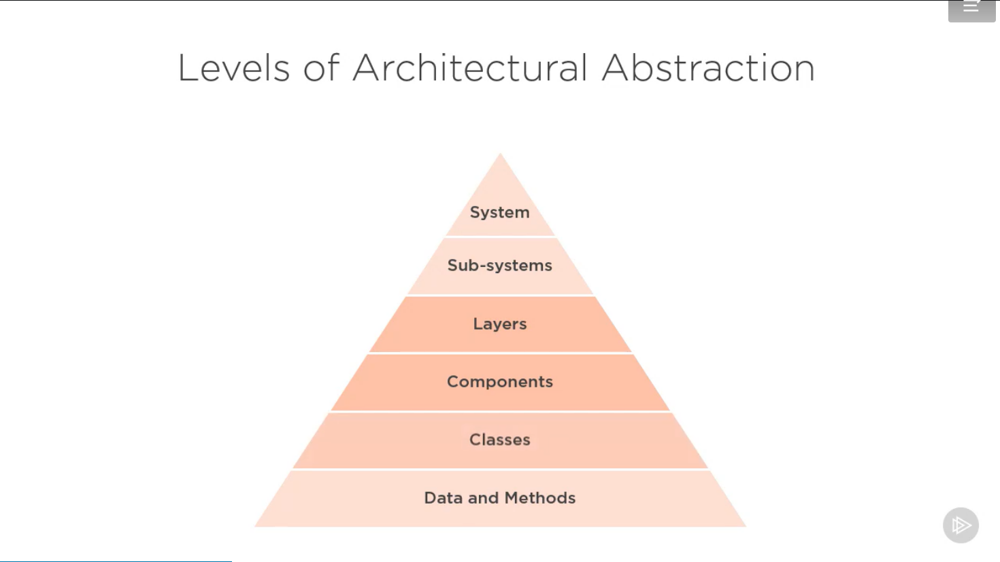

# Clean Architecture Patterns, Practices, and Principles

## Whta is Clean architecture?
is a set of practices used to create modern software architecture that is simple to understandable flexible, testable and maintainable.
Clean architecture is a modern replacement for traditional three-layer database cenetric
- architecture that is designed for the inhabitants of the architecture not for the architect or the machine

### Leveles of architecture Abstraction

### What is bad architecture?
- Complex
- Incoherent
- Rigid
- Brittle
- Untestable
- Unmaintainable

### Techonolgies
* structure map
* moq , automoq
* specflow
* Nunit