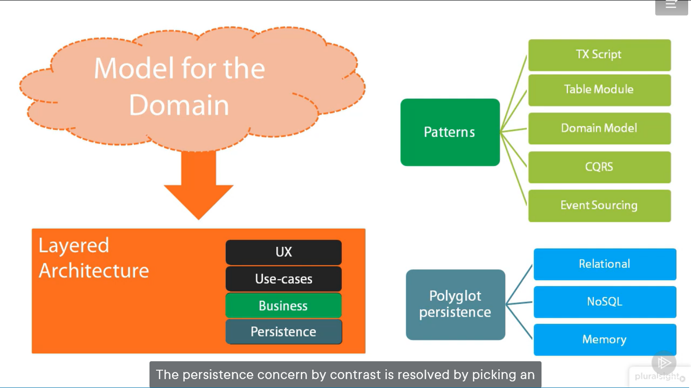

## The DDD Layer Architecture

in the previous graph :
the buisness layer resolved in appropriate design patterns to orgnize and process business rules
- TX Script
- Table Module
- Domain Model
- CQRS
- Event Sourcing

### The Presentaion Layer
presentaion layer responsiple for provideing some user interface 

### The buiseness Logic
- crunch knowladge about the business domain
- learn the language of the business domain
- split the business domain in bounded context

The business logic of a software system is made of two main parts:
* Application Logic 
* Domain Logic (is all about baking business rules into the code)

Buisness logic in Abstact defination:

Buisness logic in DDD defination:

