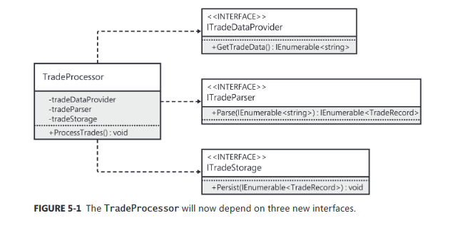

# Problem Statment
monolithic class

# Refactoring for abstraction
 is very common for a small application such as this to grow into something
much larger. When a few people start to use it, the feature requests begin to increase.
Often, the terms prototype and proof of concept are applied to such allegedly small applications, and
the conversion from prototype to production application is relatively seamless. This is why the ability
to refactor toward abstraction is such a touchstone of adaptive development. Without it, the myriad
requests devolve into a “big ball of mud”—a class, or
